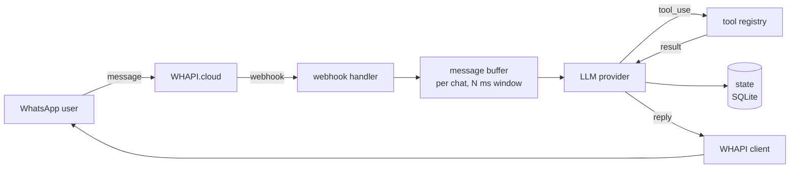

# whapi-agent

A minimal TypeScript runtime for WhatsApp AI agents on top of [WHAPI.cloud](https://whapi.cloud), with per-conversation **message buffering** to avoid fragmented LLM responses.

The buffering logic (configurable 2–5s window per chat) is the only non-obvious part of the codebase. Everything else is deliberately standard: Anthropic SDK, Express, `better-sqlite3`, `zod`, `pino`.

[](LICENSE)
[](tsconfig.json)
[](.nvmrc)

---

## Why this exists

People don't send one sentence at a time. They send four messages in two seconds. Without buffering, the agent replies four times, out of order, often answering the first message while the fourth is still arriving.

The fix is small — hold messages per-chat for a few seconds, flush the group once, feed the whole group to the LLM. The tradeoffs (latency vs. coherence, debouncing vs. hard windows, interruption handling) are worth thinking about, and this project surfaces them rather than hiding them.

See [`docs/message-buffering.md`](docs/message-buffering.md) for the full rationale.

---

## Usage

```ts
import { createAgent } from "whapi-agent";
import { z } from "zod";

const agent = createAgent({
  provider: "anthropic",
  model: "claude-sonnet-4-5",
  bufferWindowMs: 3000,
});

agent.registerTool({
  name: "get_order_status",
  description: "Return the status of an order by id.",
  schema: z.object({ orderId: z.string() }),
  execute: async ({ orderId }) => {
    return { status: "shipped", orderId };
  },
});

agent.listen(3000);
```

Point your WHAPI channel webhook at `http://<host>:3000/webhook` and send a message.

---

## Quick start (Docker)

```bash
git clone https://github.com/AlexHerranr/whapi-agent.git
cd whapi-agent
cp .env.example .env
# set ANTHROPIC_API_KEY and WHAPI_TOKEN
docker compose up
```

---

## What's in the box

- WHAPI webhook receiver.
- Per-chat message buffer with a configurable flush window.
- Anthropic provider with tool calling.
- A small tool registry with two example tools.
- SQLite-backed conversation store (`better-sqlite3`).
- Token-bucket rate limiting per chat.
- Structured logging (`pino`), `/health` endpoint.

That is all it does. It doesn't build dashboards, manage tenants, generate PDFs, or host model weights.

---

## Architecture



More detail in [`docs/architecture.md`](docs/architecture.md).

---

## Examples

- [`examples/01-hello-world`](examples/01-hello-world) — minimal echo agent with buffering, no tools.
- [`examples/02-with-tools`](examples/02-with-tools) — agent that calls `get_weather` and `search_docs`.

---

## Configuration

Environment variables are validated at startup via `zod`. See [`.env.example`](.env.example) for the full list.

Minimum required:

```
ANTHROPIC_API_KEY=
CLAUDE_MODEL=claude-sonnet-4-5
WHAPI_TOKEN=
WHAPI_API_URL=https://gate.whapi.cloud
BUFFER_WINDOW_MS=3000
```

---

## Deployment

Any host that runs Node 20 works. Docker, Railway, Fly.io, and a bare VPS with systemd are covered in [`docs/deployment.md`](docs/deployment.md).

---

## Roadmap

- **v0.1** — buffering, Anthropic, SQLite, tool registry, two examples.
- **v0.2** — OpenAI provider, Postgres store, voice notes via Whisper.
- **v0.3** — provider fallback, retry policies, metrics.
- **v1.0** — public API stability and a production checklist.

---

## Contributing

Read [`AGENTS.md`](AGENTS.md) and [`CONTRIBUTING.md`](CONTRIBUTING.md). Scope is intentionally small; discuss non-trivial changes in an issue first.

---

## License

[MIT](LICENSE).

Maintained by [Alexander H.](https://github.com/AlexHerranr) at Herran Dynamics S.A.S.
