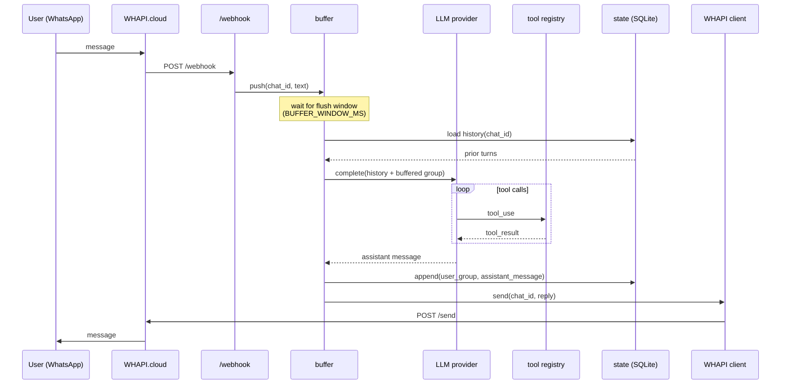

# Architecture

## Request lifecycle

## Module layout

| Module | Responsibility | Not responsible for |
|---|---|---|
| `webhook/` | Parse and validate incoming WHAPI events. Route to the buffer. | Signature crypto (WHAPI handles it). Business logic. |
| `buffer/` | Per-chat message grouping with a flush window. | Persistence. LLM calls. |
| `llm/` | Provider-agnostic interface for completions and tool calls. Anthropic implementation. | Prompt templates. Conversation history storage. |
| `tools/` | Tool registration and execution. Zod schema validation of arguments. | Tool implementations (those live in `tools/examples/` or the user's code). |
| `state/` | Conversation history load and append. | Caching. Analytics. |
| `whapi/` | Outbound HTTP client. Typing indicators. Rate-limit respect. | Webhook parsing (that's `webhook/`). |
| `utils/` | Logger, config loader, rate limiter, typed errors. | Anything domain-specific. |

## Design decisions

### One process, one SQLite file

SQLite via `better-sqlite3` is synchronous, per-connection, and adequate up to mid-thousands of messages per minute on a modest VPS. Switching to Postgres is a one-file adapter change and is scheduled for `v0.2`.

### Provider interface before second provider

The `LLMProvider` interface ships in `v0.1` even though only Anthropic is implemented. The second provider (OpenAI) lands in `v0.2`, at which point the interface will have been battle-tested against one real implementation before being locked in.

### Buffering at the message boundary, not the token boundary

See [`message-buffering.md`](message-buffering.md) — routing partial tokens is the wrong layer.

### No prompt templates in the runtime

The user decides the system prompt. The runtime concatenates: `[system, ...history, {role: "user", content: <buffered group>}]` and hands it to the provider. Prompt engineering belongs in the user's code, not here.

### Rate limiting per chat, not per process

A flood from a single abusive chat shouldn't starve other chats. Rate limits are token-bucket per `chat_id`, configured via `RATE_LIMIT_PER_MINUTE`.

### Zod for config, not for runtime payloads

Webhook payloads are trusted to match WHAPI's documented shape. Config is user-provided and validated at boot with a clear error. Tool arguments coming from the LLM are validated per-tool (the LLM can and will produce nonsense).

## What this project is not

- Not a WhatsApp client. WHAPI handles the protocol.
- Not a conversation designer. There is no visual flow editor.
- Not a multi-tenant platform. One process, one set of credentials.
- Not an LLM. Bring your own API key.
